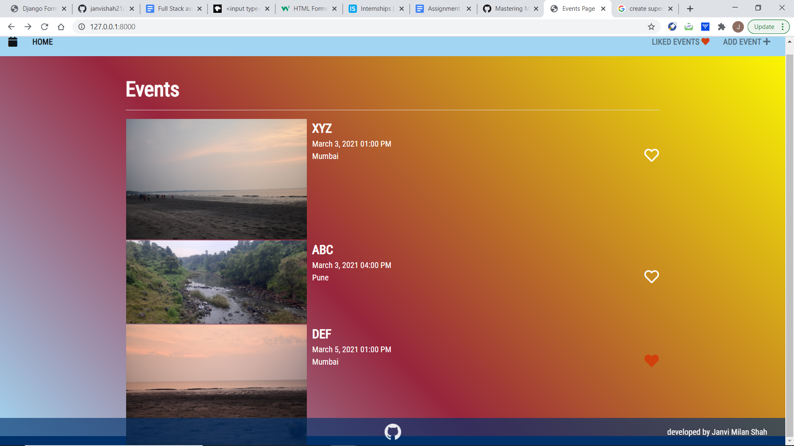

# Events Application
An events application using Django Framework where user can add any number of events to be occured. For every event, name, date, time, location, image can be specified. Users can like or unlike the event. Users can also know the liked events by navigating to the 'liked events' tab.

Preview :

